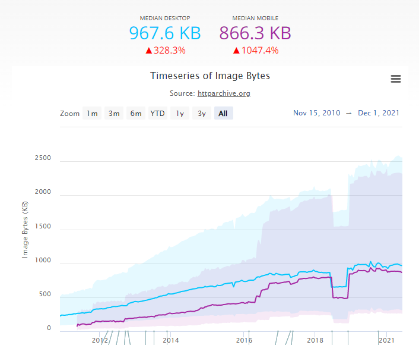

# Lazy Loading Images

# State of Images

Images are the most popular resource type on the web. In this report HTTPArchive analyze how images are being used across the web.

https://httparchive.org/reports/state-of-images

