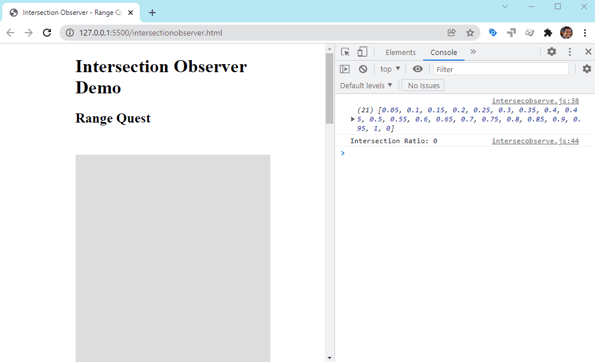

# Lazy Loading Images

# State of Images

Images are the most popular resource type on the web. In this report HTTPArchive analyze how images are being used across the web.

https://httparchive.org/reports/state-of-images


# Intersection Observer API

The Intersection Observer API provides a way to asynchronously observe changes in the intersection of a target element with an ancestor element or with a top-level document's viewport.

https://developer.mozilla.org/en-US/docs/Web/API/Intersection_Observer_API



[Live Demo](https://praveendias1180.github.io/lazy-loading/intersectionobserver.html)

# Loading Lazy

```

```
[Live Demo](https://praveendias1180.github.io/lazy-loading/index-loading-lazy.html)

## Improved data-savings and distance-from-viewport thresholds

As of July 2020, Chrome has made significant improvements to align the image lazy-loading distance-from-viewport thresholds to better meet developer expectations.

On fast connections (e.g 4G), we reduced Chrome's distance-from-viewport thresholds from 3000px to 1250px and on slower connections (e.g 3G), changed the threshold from 4000px to 2500px. This change achieves two things:

[Read More](https://web.dev/browser-level-image-lazy-loading/)

